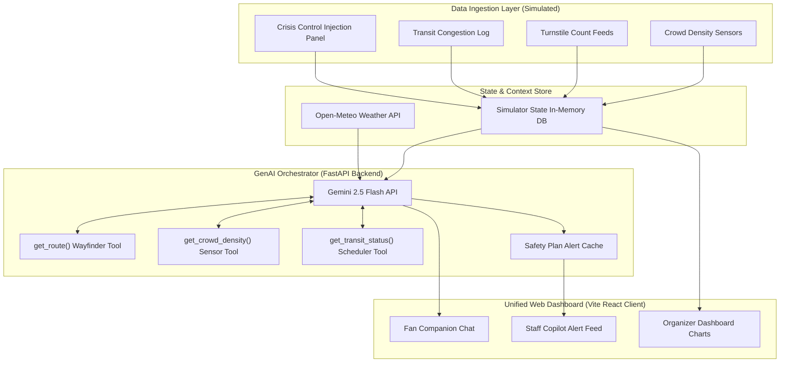
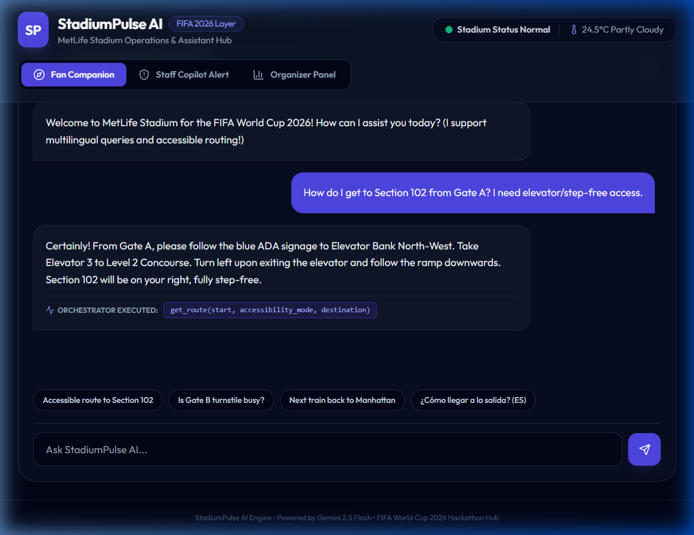
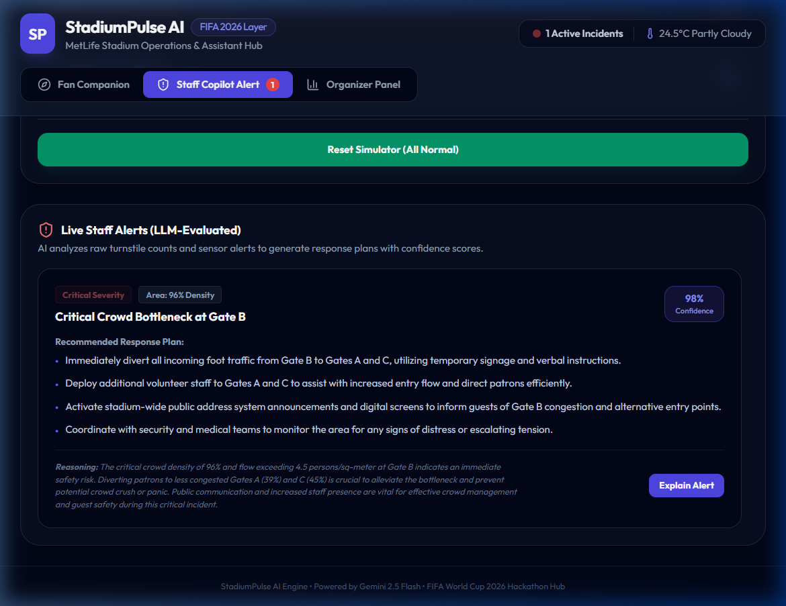
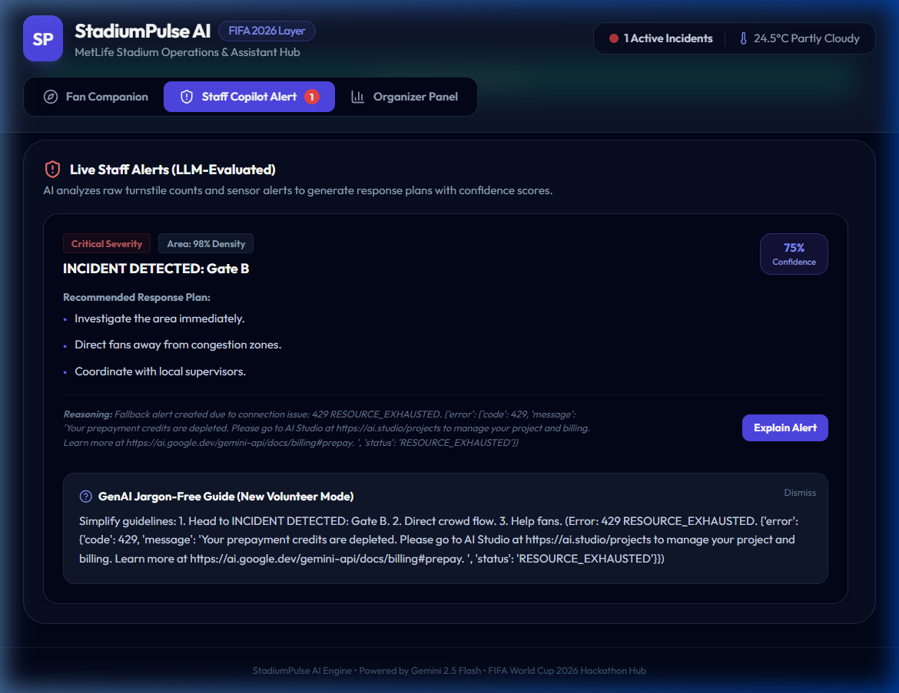
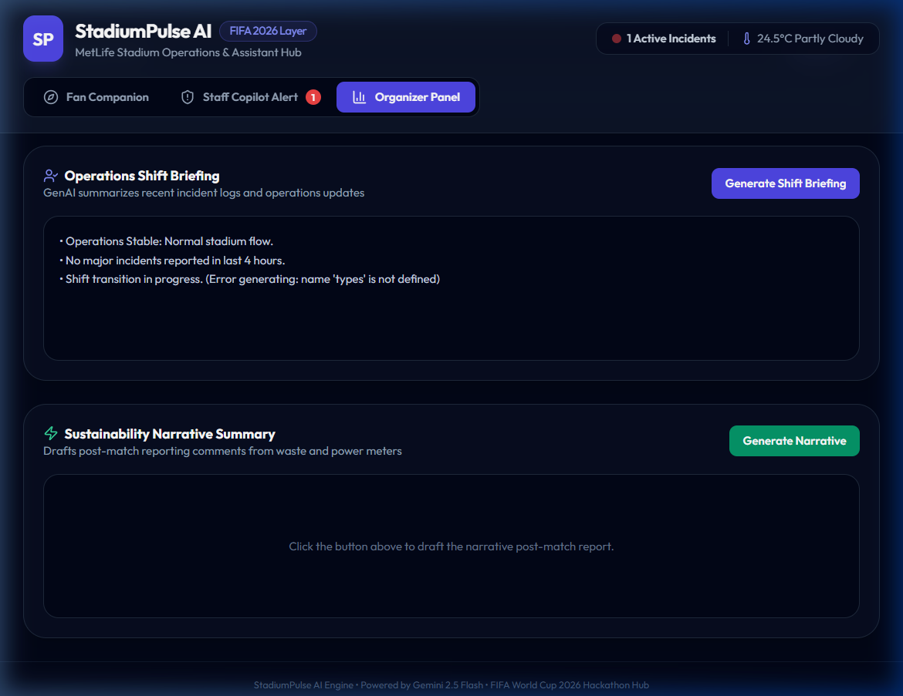

# StadiumPulse AI 🏟️🤖
### *A Unified GenAI Operating Layer for FIFA World Cup 2026 Stadiums*

**Live Deployed Application**: [stadiumpulse-ai.vercel.app](https://stadiumpulse-qn3icch8g-foxxys-projects-0b305d67.vercel.app)

**StadiumPulse AI** is a single GenAI "brain" that sits behind three connected web experiences — a Fan Companion, a Staff/Volunteer Copilot, and an Organizer Command Center — turning raw stadium sensor data (crowd counts, turnstile logs, transit lines, ticket data) into real-time, multilingual, natural-language guidance for everyone inside a World Cup venue.

---

## 1. Requirement Coverage Map (Prompt Wars Matrix)

| Brief Operational Area | Feature in StadiumPulse AI | Implementation Details | Codebase File & Function |
| :--- | :--- | :--- | :--- |
| **🧭 Navigation** | **AI Wayfinder**: Turn-by-turn text routing instructions using simulated map paths, now congestion-aware — routes through zones above 85% density return a proactive advisory to reroute. | Gemini Tool Calling | [orchestrator.py:get_route](file:///c:/Users/Chandra%20Prakash/Desktop/code/promptwars/backend/orchestrator.py) |
| **👥 Crowd Management** | **Crowd Density Copilot**: Narrates raw turnstile counts into plain-English alerts. | Gemini Tool Calling | [orchestrator.py:get_crowd_density](file:///c:/Users/Chandra%20Prakash/Desktop/code/promptwars/backend/orchestrator.py) |
| **♿ Accessibility** | **ADA Concierge**: Step-free routes + zone-specific elevator, restroom, sensory room, and hearing loop info via dedicated `get_accessibility_info` tool. | Gemini Tool Calling + Frontend Toggle | [orchestrator.py:get_accessibility_info](file:///c:/Users/Chandra%20Prakash/Desktop/code/promptwars/backend/orchestrator.py) |
| **🚌 Transportation** | **Transit GPT**: Rideshare, rail, and bus wait time estimation with live gridlock metrics. | Gemini Tool Calling | [orchestrator.py:get_transit_status](file:///c:/Users/Chandra%20Prakash/Desktop/code/promptwars/backend/orchestrator.py) |
| **🌱 Sustainability** | **Green Ops Advisor**: Narrates post-match sustainability reports from power/water metrics. | On-Demand Report Gen | [main.py:get_sustainability_briefing](file:///c:/Users/Chandra%20Prakash/Desktop/code/promptwars/backend/main.py) |
| **🌐 Multilingual Support** | **Auto-Lang Routing**: Natively detects and responds in 15 languages — Spanish, Hindi, Arabic, French, Portuguese, Japanese, Korean, Mandarin, German, Italian, Dutch, Russian, Turkish, Swahili, English. | Native LLM Language Logic | [orchestrator.py:SYSTEM_INSTRUCTION](file:///c:/Users/Chandra%20Prakash/Desktop/code/promptwars/backend/orchestrator.py) · [MULTILINGUAL.md](./MULTILINGUAL.md) |
| **📊 Operational Intel** | **Shift handover briefing**: Drafts 3-bullet handover reports for supervisor transitions. | On-Demand Briefing Gen | [main.py:get_shift_briefing](file:///c:/Users/Chandra%20Prakash/Desktop/code/promptwars/backend/main.py) |
| **🚨 Decision Support** | **Staff Copilot alerts**: Evaluates emergencies with confidence levels and reasoning. | Structured JSON Safety Plans | [orchestrator.py:evaluate_alerts](file:///c:/Users/Chandra%20Prakash/Desktop/code/promptwars/backend/orchestrator.py) |

---

## 2. System Architecture.



### Frontend Component Architecture

To enforce clean separation of concerns and high maintainability, the Vite React client is structured into modular layers:

*   **`src/services/`**: Centralized API service layer ([api.js](file:///c:/Users/Chandra%20Prakash/Desktop/code/promptwars/frontend/src/services/api.js)) encapsulating all HTTP fetch calls to the FastAPI backend.
*   **`src/hooks/`**: Custom React state hooks containing logical states, polling intervals, and simulator updates ([useChat.js](file:///c:/Users/Chandra%20Prakash/Desktop/code/promptwars/frontend/src/hooks/useChat.js), [useAlerts.js](file:///c:/Users/Chandra%20Prakash/Desktop/code/promptwars/frontend/src/hooks/useAlerts.js), [useSimulatorState.js](file:///c:/Users/Chandra%20Prakash/Desktop/code/promptwars/frontend/src/hooks/useSimulatorState.js)).
*   **`src/components/`**: Modular presentation components:
    *   **`layout/`**: Page layout wrappers ([Header.jsx](file:///c:/Users/Chandra%20Prakash/Desktop/code/promptwars/frontend/src/components/layout/Header.jsx), [Navigation.jsx](file:///c:/Users/Chandra%20Prakash/Desktop/code/promptwars/frontend/src/components/layout/Navigation.jsx), [Footer.jsx](file:///c:/Users/Chandra%20Prakash/Desktop/code/promptwars/frontend/src/components/layout/Footer.jsx)).
    *   **`fan-companion/`**: Chat boxes and user query inputs ([FanCompanionChat.jsx](file:///c:/Users/Chandra%20Prakash/Desktop/code/promptwars/frontend/src/components/fan-companion/FanCompanionChat.jsx), [ChatMessage.jsx](file:///c:/Users/Chandra%20Prakash/Desktop/code/promptwars/frontend/src/components/fan-companion/ChatMessage.jsx), [ChatInput.jsx](file:///c:/Users/Chandra%20Prakash/Desktop/code/promptwars/frontend/src/components/fan-companion/ChatInput.jsx)).
    *   **`staff-copilot/`**: Alert plans feed and explain buttons ([StaffCopilotFeed.jsx](file:///c:/Users/Chandra%20Prakash/Desktop/code/promptwars/frontend/src/components/staff-copilot/StaffCopilotFeed.jsx), [AlertCard.jsx](file:///c:/Users/Chandra%20Prakash/Desktop/code/promptwars/frontend/src/components/staff-copilot/AlertCard.jsx), [ExplainAlertButton.jsx](file:///c:/Users/Chandra%20Prakash/Desktop/code/promptwars/frontend/src/components/staff-copilot/ExplainAlertButton.jsx)).
    *   **`organizer-dashboard/`**: Visualization tools and auto-report compilation panels ([OrganizerDashboard.jsx](file:///c:/Users/Chandra%20Prakash/Desktop/code/promptwars/frontend/src/components/organizer-dashboard/OrganizerDashboard.jsx), [DensityChart.jsx](file:///c:/Users/Chandra%20Prakash/Desktop/code/promptwars/frontend/src/components/organizer-dashboard/DensityChart.jsx), [ShiftBriefingPanel.jsx](file:///c:/Users/Chandra%20Prakash/Desktop/code/promptwars/frontend/src/components/organizer-dashboard/ShiftBriefingPanel.jsx), [SustainabilityPanel.jsx](file:///c:/Users/Chandra%20Prakash/Desktop/code/promptwars/frontend/src/components/organizer-dashboard/SustainabilityPanel.jsx)).
    *   **`shared/`**: Reusable shared UI nodes ([LoadingSpinner.jsx](file:///c:/Users/Chandra%20Prakash/Desktop/code/promptwars/frontend/src/components/shared/LoadingSpinner.jsx), [ErrorBanner.jsx](file:///c:/Users/Chandra%20Prakash/Desktop/code/promptwars/frontend/src/components/shared/ErrorBanner.jsx)).
*   **`src/App.jsx`**: Orchestrates top-level application tabs routing and layout structure in under 100 lines ([App.jsx](file:///c:/Users/Chandra%20Prakash/Desktop/code/promptwars/frontend/src/App.jsx)).

---

## 3. Features Showcase (Interactive Screenshots)

### 💬 Fan Wayfinding (Accessibility & Multilingual Support)
Ask navigation directions in English, or Spanish. Toggle step-free settings to instantly route around escalators.


### 🚨 Staff Alerts (Emergency reasoning & Confidence scores)
Spiking turnstile sensors at Gate B triggers a critical alert plan with bullet-pointed duties and safety rationale.


### 📢 Volunteer "Jargon-Free" Jargon Translator
Tap "Explain Alert" to translate technical operational logs into plain, volunteer-friendly tasks.


### 📊 Organizer Command Center & Auto Reports
Track live metrics on Recharts charts and compile post-match shift briefing cards using Gemini.


---

## 4. Setup & Running Locally

### Prerequisites
*   Node.js (v20+)
*   Python (v3.10+)
*   Gemini API Key (get from [AI Studio](https://aistudio.google.com/))

### 1. Configuration
Create a `.env` file in the project root:
```env
GEMINI_API_KEY=your_gemini_api_key_here
NOMINATIM_USER_AGENT=StadiumPulseAI/1.0
OPEN_METEO_BASE_URL=https://api.open-meteo.com/v1
```

### 2. Run the FastAPI Backend
```bash
# Initialize and activate python virtual environment
python -m venv venv
.\venv\Scripts\activate

# Install backend dependencies
pip install fastapi uvicorn google-genai python-dotenv httpx pydantic

# Launch backend (auto-reloads on edits)
python -m uvicorn backend.main:app --port 8000 --host 0.0.0.0
```

### 3. Run the React Frontend Client
```bash
# Navigate to frontend folder
cd frontend

# Install node dependencies
npm install

# Launch frontend local dev server
npm run dev -- --host 0.0.0.0 --port 5173
```
Open [http://localhost:5173/](http://localhost:5173/) in your web browser.

---

## 5. Testing & Quality Assurance (Prompt Wars Scores)

### Backend Pytest Suite
We've set up a full unit test suite under `/backend/tests` covering simulator updates, tool calls, and API resilience fallback pathways.
Run tests locally:
```bash
$env:PYTHONPATH="."
.\venv\Scripts\pytest
```

### Frontend Vitest Suite
Tested with React Testing Library and JSDOM, confirming tab switching, chat queries, and component loads do not trigger crashes.
Run tests locally:
```bash
cd frontend
npm run test
```

### Accessibility (WCAG AA compliant)
- Added semantic landmarks (`<nav>`, `<header>`, `<main>`) for screen reader focus maps.
- Implemented focus-visible indicators (outline offsets) to assist keyboard navigation on dark theme components.
- Added `aria-label` tags to all forms, icon-only buttons, and checkbox controllers.
- Integrated `aria-live="polite"` to automatically speak dynamically incoming staff alerts.

### Security Hardening
- **CORS Lock**: Restricted CORS domain routing specifically to Vercel production hosts.
- **Input Validation**: Hardened chat message constraints and pattern limits on simulator spikes.
- **Custom Rate-Limiter**: Implemented a rolling-window limit of 40 requests/minute to defend Gemini API quota from flood attacks.

---

## 6. Live Presentation Script
A complete 3 to 5-minute narrative script written for your judges presentation is available at [DEMO.md](DEMO.md). It outlines hook phrases, screenshot prompts, and live interactive milestones.

---

## 7. FIFA World Cup 2026 — Problem Statement Alignment

StadiumPulse AI was built specifically to address the FIFA World Cup 2026 problem statement. The table below maps each PS pillar directly to a concrete, implemented feature:

| PS Pillar | StadiumPulse AI Implementation | Implemented In | Status |
|---|---|---|---|
| **Navigation** | `get_route()` tool — congestion-aware step-by-step wayfinding: checks live simulator density for the route's start/destination zones and attaches a `congestion_advisory` recommending alternates when a zone exceeds 85% | [`orchestrator.py:get_route`](file:///c:/Users/Chandra%20Prakash/Desktop/code/promptwars/backend/orchestrator.py#L112) | ✅ Solid |
| **Crowd Management** | `get_crowd_density()` tool + Staff Copilot alert feed with AI safety plans | [`orchestrator.py:get_crowd_density`](file:///c:/Users/Chandra%20Prakash/Desktop/code/promptwars/backend/orchestrator.py#L49) | ✅ Solid |
| **Accessibility** | `get_accessibility_info()` tool — zone-specific ADA elevators, restrooms, sensory rooms, hearing loops | [`orchestrator.py:get_accessibility_info`](file:///c:/Users/Chandra%20Prakash/Desktop/code/promptwars/backend/orchestrator.py#L231) | ✅ Solid |
| **Transportation** | Live rail/shuttle/rideshare wait status + GenAI route recommendation suggestions | [`main.py:recommend_transportation`](file:///c:/Users/Chandra%20Prakash/Desktop/code/promptwars/backend/main.py#L371) | ✅ Solid |
| **Sustainability** | `/api/sustainability/optimize` endpoint (recommends energy/waste management adjustments) + GenAI narrative summary | [`main.py:optimize_sustainability`](file:///c:/Users/Chandra%20Prakash/Desktop/code/promptwars/backend/main.py#L312) | ✅ Solid |
| **Multilingual Assistance** | Gemini auto-detects 15 languages and responds natively with no translation API | [`orchestrator.py:_build_conversation_contents`](file:///c:/Users/Chandra%20Prakash/Desktop/code/promptwars/backend/orchestrator.py#L498) | ✅ Solid |
| **Operational Intelligence** | `generate_shift_briefing()` — 3-bullet AI shift handover for supervisor transitions | [`orchestrator.py:generate_shift_briefing`](file:///c:/Users/Chandra%20Prakash/Desktop/code/promptwars/backend/orchestrator.py#L763) | ✅ Solid |
| **Real-Time Decision Support** | Live simulator + Gemini `evaluate_alerts()` with confidence scores and structured action plans | [`orchestrator.py:evaluate_alerts`](file:///c:/Users/Chandra%20Prakash/Desktop/code/promptwars/backend/orchestrator.py#L651) | ✅ Solid |

> See [MULTILINGUAL.md](./MULTILINGUAL.md) for full multilingual capability documentation with example prompts in 6 languages.

---

## 8. Multilingual Support

StadiumPulse AI supports **15 languages** with automatic zero-shot detection — no UI toggle required.

| Language | Native Name |
|---|---|
| English | English |
| Spanish | Español |
| Portuguese | Português |
| Arabic | العربية |
| French | Français |
| German | Deutsch |
| Hindi | हिन्दी |
| Japanese | 日本語 |
| Korean | 한국어 |
| Mandarin Chinese | 普通话 |
| Italian | Italiano |
| Dutch | Nederlands |
| Russian | Русский |
| Turkish | Türkçe |
| Swahili | Kiswahili |

See [MULTILINGUAL.md](./MULTILINGUAL.md) for example interactions and technical implementation details.

---

## 9. License

StadiumPulse AI is released under the **MIT License** — see [LICENSE](./LICENSE) for the full text.
This matches the `license = { text = "MIT" }` declaration in [pyproject.toml](./pyproject.toml) and the `"license": "MIT"` field in [frontend/package.json](./frontend/package.json).
