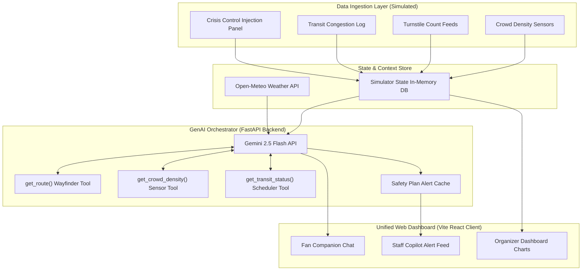

# StadiumPulse AI 🏟️🤖
### *A Unified GenAI Operating Layer for FIFA World Cup 2026 Stadiums*

**Live Deployed Application**: [stadiumpulse-ai.vercel.app](https://stadiumpulse-qn3icch8g-foxxys-projects-0b305d67.vercel.app)

**StadiumPulse AI** is a single GenAI "brain" that sits behind three connected web experiences — a Fan Companion, a Staff/Volunteer Copilot, and an Organizer Command Center — turning raw stadium sensor data (crowd counts, turnstile logs, transit lines, ticket data) into real-time, multilingual, natural-language guidance for everyone inside a World Cup venue.

---

## 1. Requirement Coverage Map (Prompt Wars Matrix)

| Brief Operational Area | Feature in StadiumPulse AI | Status |
| :--- | :--- | :--- |
| **🧭 Navigation** | **AI Wayfinder**: Turn-by-turn text routing instructions using simulated map paths. | **Active (Gemini Tool)** |
| **👥 Crowd Management** | **Crowd Density Copilot**: Narrates raw turnstile counts into plain-English alerts. | **Active (Gemini Tool)** |
| **♿ Accessibility** | **Accessibility Concierge**: Step-free navigation mode bypassing stairs/escalators. | **Active (Config Toggle)** |
| **🚌 Transportation** | **Transit GPT**: Rideshare, rail, and bus wait time estimation with live gridlock metrics. | **Active (Gemini Tool)** |
| **🌱 Sustainability** | **Green Ops Advisor**: Narrates post-match sustainability reports from power/water metrics. | **Active (On-Demand Gen)** |
| **🌐 Multilingual Support** | **Auto-Lang Routing**: Natively detects and responds in Spanish, Hindi, Arabic, etc. | **Active (Native LLM)** |
| **📊 Operational Intel** | **Shift handover briefing**: Drafts 3-bullet handover reports for supervisor transitions. | **Active (On-Demand Gen)** |
| **🚨 Decision Support** | **Staff Copilot alerts**: Evaluates emergencies with confidence levels and reasoning. | **Active (Structured JSON)** |

---

## 2. System Architecture



---

## 3. Features Showcase (Interactive Screenshots)

### 💬 Fan Wayfinding (Accessibility & Multilingual Support)
Ask navigation directions in English, or Spanish. Toggle step-free settings to instantly route around escalators.


### 🚨 Staff Alerts (Emergency reasoning & Confidence scores)
Spiking turnstile sensors at Gate B triggers a critical alert plan with bullet-pointed duties and safety rationale.


### 📢 Volunteer "Jargon-Free" Jargon Translator
Tap "Explain Alert" to translate technical operational logs into plain, volunteer-friendly tasks.


### 📊 Organizer Command Center & Auto Reports
Track live metrics on Recharts charts and compile post-match shift briefing cards using Gemini.


---

## 4. Setup & Running Locally

### Prerequisites
*   Node.js (v20+)
*   Python (v3.10+)
*   Gemini API Key (get from [AI Studio](https://aistudio.google.com/))

### 1. Configuration
Create a `.env` file in the project root:
```env
GEMINI_API_KEY=your_gemini_api_key_here
NOMINATIM_USER_AGENT=StadiumPulseAI/1.0
OPEN_METEO_BASE_URL=https://api.open-meteo.com/v1
```

### 2. Run the FastAPI Backend
```bash
# Initialize and activate python virtual environment
python -m venv venv
.\venv\Scripts\activate

# Install backend dependencies
pip install fastapi uvicorn google-genai python-dotenv httpx pydantic

# Launch backend (auto-reloads on edits)
python -m uvicorn backend.main:app --port 8000 --host 0.0.0.0
```

### 3. Run the React Frontend Client
```bash
# Navigate to frontend folder
cd frontend

# Install node dependencies
npm install

# Launch frontend local dev server
npm run dev -- --host 0.0.0.0 --port 5173
```
Open [http://localhost:5173/](http://localhost:5173/) in your web browser.

---

## 5. Live Presentation Script
A complete 3 to 5-minute narrative script written for your judges presentation is available at [DEMO.md](DEMO.md). It outlines hook phrases, screenshot prompts, and live interactive milestones.
